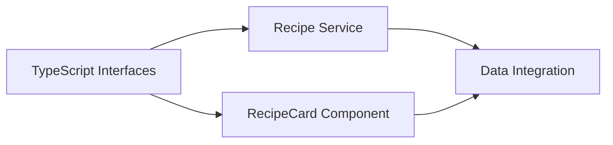
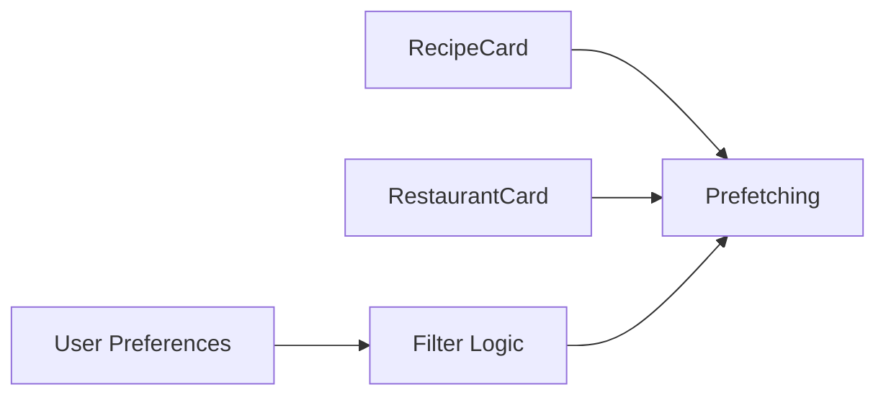
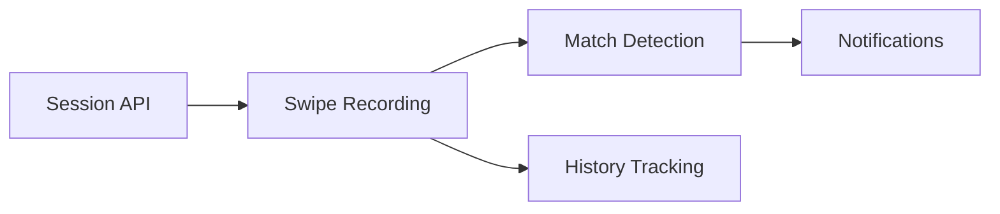
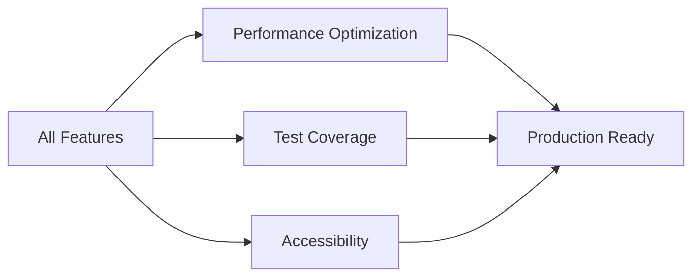

# 🚀 Agile Card Swipe Implementation Workflow

**Project**: DinDin - Replace Static Images with Dynamic Recipe/Restaurant Data
**Duration**: 8 weeks (4 sprints × 2 weeks)
**Team Size**: 2-3 developers
**Strategy**: Agile with parallel task streams

---

## 📋 Executive Summary

Transform the current static image-based card swiping feature into a dynamic, data-driven experience with real recipe and restaurant information fetched from the backend API.

### 🎯 Key Deliverables
- Dynamic RecipeCard and RestaurantCard components
- Backend API integration with batch fetching
- Real-time session synchronization
- Improved type safety and performance
- Comprehensive testing coverage

### ⚡ Parallel Execution Streams

**Stream A - Frontend Components** (UI/UX Developer)
- RecipeCard development
- RestaurantCard development
- Loading states & animations
- Visual polish & accessibility

**Stream B - Backend Integration** (Full-Stack Developer)
- API client implementation
- Data fetching & caching
- Session management
- WebSocket integration

**Stream C - Quality & Performance** (Senior Developer)
- TypeScript improvements
- Testing implementation
- Performance optimization
- Code review & mentoring

---

## 🏃 Sprint Overview

### Sprint 1: Foundation & Core Infrastructure (Weeks 1-2)
**Goal**: Set up data architecture and core components

### Sprint 2: Enhanced UX & Frontend Components (Weeks 3-4)
**Goal**: Complete UI components with full data integration

### Sprint 3: Backend Integration & Persistence (Weeks 5-6)
**Goal**: Full API integration with session management

### Sprint 4: Performance & Polish (Weeks 7-8)
**Goal**: Optimization, testing, and production readiness

---

## 📅 Sprint 1: Foundation & Core Infrastructure

### 🎯 Sprint Goal
Establish data architecture and implement core RecipeCard component with type-safe interfaces

### 👥 User Stories

#### US-1.1: As a user, I want to see real recipe information on cards
**Priority**: High | **Points**: 8 | **Stream**: A + B

**Tasks** (Can run in parallel):
- [ ] **Stream A**: Create RecipeCard component structure
- [ ] **Stream B**: Define TypeScript interfaces for Recipe data
- [ ] **Stream C**: Set up testing framework for new components

**Acceptance Criteria**:
- RecipeCard displays: image, name, calories, prep time, difficulty
- TypeScript interfaces match backend schema
- Component is fully typed with no `any` types

#### US-1.2: As a developer, I want a robust data fetching service
**Priority**: High | **Points**: 5 | **Stream**: B

**Tasks**:
- [ ] Create `recipeService.ts` with batch fetching
- [ ] Implement error handling and retry logic
- [ ] Add response caching mechanism

**Acceptance Criteria**:
- Service fetches from `/recipes/swipe/batch` endpoint
- Handles network errors gracefully
- Caches responses for 5 minutes

#### US-1.3: As a user, I want smooth loading states
**Priority**: Medium | **Points**: 3 | **Stream**: A

**Tasks**:
- [ ] Design skeleton loader component
- [ ] Implement loading animation
- [ ] Add error state UI

**Dependencies**: None (can start immediately)

### 🔗 Sprint 1 Dependencies

### ✅ Sprint 1 Deliverables
- [ ] RecipeCard component with real data
- [ ] Recipe data service with caching
- [ ] TypeScript interfaces for all data types
- [ ] Loading and error states
- [ ] Unit tests for new components

---

## 📅 Sprint 2: Enhanced UX & Frontend Components

### 🎯 Sprint Goal
Complete RestaurantCard, enhance UX with metadata display, and implement prefetching

### 👥 User Stories

#### US-2.1: As a user, I want to see restaurant information on cards
**Priority**: High | **Points**: 5 | **Stream**: A

**Tasks**:
- [ ] Create RestaurantCard component
- [ ] Design metadata overlay UI
- [ ] Implement rating display system

**Acceptance Criteria**:
- RestaurantCard shows: image, name, cuisine, rating, price range
- Information is clearly visible without overwhelming the image
- Responsive design for different screen sizes

#### US-2.2: As a user, I want instant card loading with no delays
**Priority**: High | **Points**: 8 | **Stream**: B

**Tasks** (Parallel execution):
- [ ] **Stream B**: Implement prefetching strategy
- [ ] **Stream B**: Create data queue management
- [ ] **Stream C**: Optimize image loading with progressive enhancement

**Acceptance Criteria**:
- Next 5 cards always preloaded
- Images use progressive loading
- No visible delay when swiping

#### US-2.3: As a user, I want to filter recipes by preferences
**Priority**: Medium | **Points**: 5 | **Stream**: A + B

**Tasks**:
- [ ] **Stream A**: Add filter UI controls
- [ ] **Stream B**: Implement filter logic in service
- [ ] **Stream B**: Connect to user preferences API

**Dependencies**: US-1.2 (Recipe Service)

### 🔗 Sprint 2 Dependencies

### ✅ Sprint 2 Deliverables
- [ ] RestaurantCard component
- [ ] Prefetching system with queue management
- [ ] Filter functionality
- [ ] Optimized image loading
- [ ] Integration tests

---

## 📅 Sprint 3: Backend Integration & Persistence

### 🎯 Sprint Goal
Complete backend integration with session management and swipe persistence

### 👥 User Stories

#### US-3.1: As a user, I want my swipes to be saved in the session
**Priority**: High | **Points**: 8 | **Stream**: B

**Tasks**:
- [ ] Integrate with `/sessions/:id/swipe` endpoint
- [ ] Implement optimistic updates
- [ ] Add offline queue for failed requests

**Acceptance Criteria**:
- Every swipe is recorded to backend
- Swipes work offline and sync when reconnected
- Match notifications appear in real-time

#### US-3.2: As a user, I want to see my dining history
**Priority**: Medium | **Points**: 5 | **Stream**: B + C

**Tasks** (Parallel):
- [ ] **Stream B**: Connect to dining history API
- [ ] **Stream C**: Add history persistence layer
- [ ] **Stream A**: Create history view component

**Dependencies**: US-3.1 (Session integration)

#### US-3.3: As a user, I want real-time match notifications
**Priority**: High | **Points**: 5 | **Stream**: B

**Tasks**:
- [ ] Implement WebSocket connection
- [ ] Add match detection logic
- [ ] Create notification system

**Acceptance Criteria**:
- Matches appear within 2 seconds
- Notifications show match details
- WebSocket reconnects automatically

### 🔗 Sprint 3 Dependencies

### ✅ Sprint 3 Deliverables
- [ ] Complete session integration
- [ ] Swipe persistence with offline support
- [ ] Real-time match notifications
- [ ] Dining history tracking
- [ ] E2E tests for critical flows

---

## 📅 Sprint 4: Performance & Polish

### 🎯 Sprint Goal
Optimize performance, achieve quality targets, and prepare for production

### 👥 User Stories

#### US-4.1: As a user, I want buttery smooth 60fps animations
**Priority**: High | **Points**: 8 | **Stream**: C

**Tasks**:
- [ ] Profile and optimize render performance
- [ ] Implement virtual scrolling
- [ ] Optimize gesture handlers

**Acceptance Criteria**:
- Consistent 60fps during swipes
- Memory usage < 50MB
- No janky animations

#### US-4.2: As a developer, I want comprehensive test coverage
**Priority**: High | **Points**: 5 | **Stream**: C

**Tasks** (Can parallelize):
- [ ] Unit tests to 80% coverage
- [ ] Integration tests for API flows
- [ ] E2E tests for critical paths
- [ ] Performance benchmarks

**Dependencies**: All previous sprints

#### US-4.3: As a user, I want accessibility support
**Priority**: Medium | **Points**: 3 | **Stream**: A

**Tasks**:
- [ ] Add screen reader support
- [ ] Implement keyboard navigation
- [ ] Ensure WCAG 2.1 AA compliance

### 🔗 Sprint 4 Dependencies

### ✅ Sprint 4 Deliverables
- [ ] Performance optimization complete
- [ ] 80%+ test coverage
- [ ] Accessibility compliance
- [ ] Production deployment checklist
- [ ] Documentation updates

---

## 📊 Parallel Execution Matrix

| Week | Stream A (Frontend) | Stream B (Backend) | Stream C (Quality) |
|------|-------------------|-------------------|-------------------|
| 1 | RecipeCard UI | TypeScript interfaces | Testing setup |
| 2 | Loading states | Recipe service | Unit tests |
| 3 | RestaurantCard | Prefetching logic | Image optimization |
| 4 | Filter UI | Filter service | Integration tests |
| 5 | History view | Session integration | Performance profiling |
| 6 | Match notifications UI | WebSocket setup | E2E test framework |
| 7 | Accessibility | Offline sync | Performance fixes |
| 8 | Polish & refinement | API optimization | Final testing |

---

## 🎯 Success Metrics

### Performance Targets
- **Frame Rate**: Consistent 60fps during swipes
- **API Response**: < 500ms for batch requests
- **Memory Usage**: < 50MB peak on mobile
- **Time to Interactive**: < 2 seconds

### Quality Targets
- **TypeScript Coverage**: 100% (no `any` types)
- **Unit Test Coverage**: > 80%
- **Integration Test Coverage**: All API endpoints
- **Accessibility Score**: > 90%

### Business Metrics
- **User Engagement**: 20% increase in swipes per session
- **Match Rate**: 15% increase in successful matches
- **Session Duration**: 25% increase in average session time
- **Error Rate**: < 0.1% for API calls

---

## 🚨 Risk Mitigation

| Risk | Impact | Mitigation | Owner |
|------|--------|------------|-------|
| API rate limits | High | Implement aggressive caching and batching | Stream B |
| Performance regression | High | Continuous profiling and benchmarking | Stream C |
| Type mismatches | Medium | Strict TypeScript, API contract tests | Stream C |
| Offline sync conflicts | Medium | Conflict resolution strategy, user feedback | Stream B |
| Image loading delays | Low | Progressive loading, CDN optimization | Stream A |

---

## 📝 Definition of Done

### Component Level
- [ ] TypeScript interfaces defined
- [ ] Component fully typed (no `any`)
- [ ] Unit tests written (>80% coverage)
- [ ] Storybook story created
- [ ] Accessibility validated
- [ ] Code reviewed by senior developer

### Feature Level
- [ ] All acceptance criteria met
- [ ] Integration tests passing
- [ ] Performance benchmarks met
- [ ] Documentation updated
- [ ] E2E tests passing
- [ ] Product owner approval

### Sprint Level
- [ ] All stories completed
- [ ] Sprint retrospective conducted
- [ ] Demo to stakeholders
- [ ] Deployment to staging
- [ ] Performance regression tests passing
- [ ] Security review completed

---

## 🔄 Continuous Improvement

### Weekly Ceremonies
- **Monday**: Sprint planning (Sprint start weeks)
- **Wednesday**: Mid-sprint check-in
- **Friday**: Demo & retrospective (Sprint end weeks)

### Daily Standups
- **Stream A**: 9:00 AM - Frontend sync
- **Stream B**: 9:15 AM - Backend sync
- **Stream C**: 9:30 AM - Quality sync
- **Full Team**: 9:45 AM - Cross-stream coordination

### Code Review Protocol
1. PR must include tests
2. Two approvals required (one from Stream C)
3. Performance impact assessed
4. TypeScript coverage verified
5. Accessibility checked

---

## 📚 Technical Resources

### API Endpoints
- `GET /recipes/swipe/batch` - Fetch recipe batch
- `POST /sessions/:id/swipe` - Record swipe
- `GET /sessions/:id` - Get session state
- `GET /users/:id/preferences` - User preferences
- `GET /users/:id/dining-history` - Dining history

### Key Dependencies
- `react-native-reanimated`: Animation engine
- `react-native-gesture-handler`: Gesture detection
- `expo-image`: Optimized image loading
- `@tanstack/react-query`: Data fetching & caching
- `socket.io-client`: WebSocket connection

### Performance Tools
- React DevTools Profiler
- Flipper for React Native
- Chrome DevTools Performance tab
- Custom performance monitoring

---

## ✅ Implementation Checklist

### Week 1-2 Checklist
- [ ] TypeScript interfaces defined
- [ ] RecipeCard component complete
- [ ] Recipe service implemented
- [ ] Loading states functional
- [ ] Unit tests for RecipeCard

### Week 3-4 Checklist
- [ ] RestaurantCard component complete
- [ ] Prefetching system operational
- [ ] Filter functionality working
- [ ] Image optimization implemented
- [ ] Integration tests passing

### Week 5-6 Checklist
- [ ] Session integration complete
- [ ] Swipe persistence working
- [ ] Match notifications functional
- [ ] Dining history connected
- [ ] E2E tests implemented

### Week 7-8 Checklist
- [ ] Performance targets met
- [ ] Test coverage > 80%
- [ ] Accessibility compliant
- [ ] Production ready
- [ ] Documentation complete

---

## 🎉 Project Completion Criteria

The project is considered complete when:

1. ✅ All user stories are implemented and tested
2. ✅ Performance metrics are met (60fps, <50MB memory)
3. ✅ Test coverage exceeds 80%
4. ✅ Zero critical or high-priority bugs
5. ✅ Accessibility score > 90%
6. ✅ Documentation is complete
7. ✅ Product owner sign-off received
8. ✅ Successfully deployed to production

---

*Generated by SuperClaude Workflow Generator v1.0*
*Last Updated: 2024*