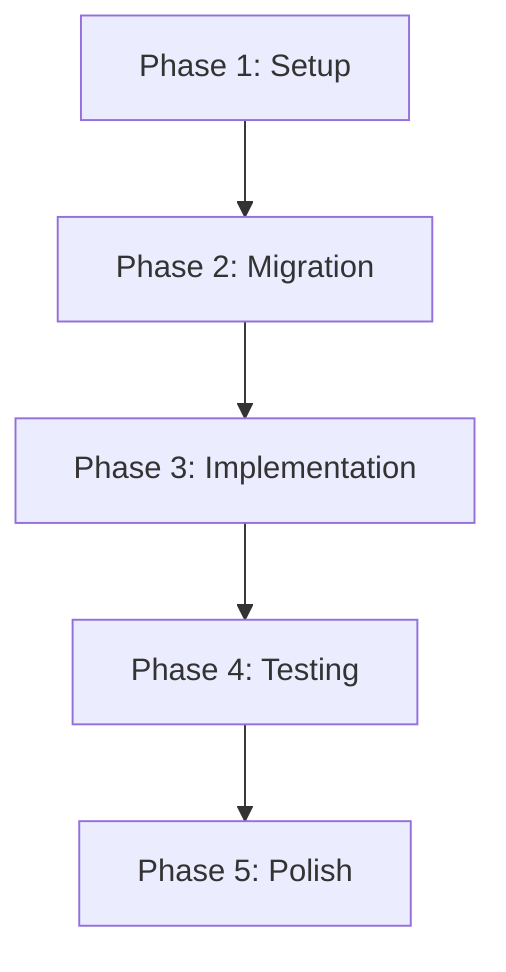

# 🚀 DinDin App - Custom Tabs Implementation Workflow

## Executive Summary
Systematic workflow for implementing nested tabs within the home route using Expo Router's headless tabs with custom Skia animations.

**Timeline**: 2-3 days | **Complexity**: Medium | **Risk**: Low

---

## 📊 Workflow Overview



---

## Phase 1: Project Setup & Preparation
**Duration**: 2-3 hours | **Parallel Tasks**: Yes

### 1.1 Environment Verification
```bash
# Verify SDK version
expo --version  # Should be SDK 52+

# Check current branch
git status
git checkout -b feature/nested-tabs-implementation
```

### 1.2 Backup Current Implementation
- [ ] Create backup branch: `git checkout -b backup/pre-tabs-migration`
- [ ] Document current navigation flow
- [ ] Screenshot existing UI for reference

### 1.3 Dependency Audit
```bash
# Check for required dependencies
bun list | grep -E "expo-router|react-native-skia|reanimated"
```

**Required Versions:**
- `expo-router`: ^4.0.0 (SDK 52)
- `@shopify/react-native-skia`: ^1.5.0
- `react-native-reanimated`: ^4.0.0-alpha.9

---

## Phase 2: Skia Tab Bar Migration
**Duration**: 3-4 hours | **Parallel Tasks**: No

### 2.1 Extract Skia Components
```bash
# Create component directory
mkdir -p apps/frontend/components/navigation/custom-tabs

# Copy Skia tab bar files
cp -r apps/frontend/Design-Inspiration/bottom-bar-skia/* \
      apps/frontend/components/navigation/custom-tabs/
```

### 2.2 Create CustomSkiaTabBar Component

```typescript
// apps/frontend/components/navigation/custom-tabs/CustomSkiaTabBar.tsx
import React, { useState, useCallback, useMemo } from 'react';
import { View, StyleSheet, useWindowDimensions } from 'react-native';
import { TabTrigger } from 'expo-router/ui';
import {
  Canvas,
  Path,
  Blur,
  Circle,
  Group,
  Paint,
  ColorMatrix,
  Skia,
  rect
} from '@shopify/react-native-skia';
import * as Haptics from 'expo-haptics';
import { useDerivedValue, withSpring } from 'react-native-reanimated';
import { useSafeAreaInsets } from 'react-native-safe-area-context';
import { SkiaTabButton } from './SkiaTabButton';

const BOTTOM_BAR_HEIGHT_OFFSET = 50;

export function CustomSkiaTabBar() {
  const [currentIndex, setCurrentIndex] = useState(0);
  const { width: screenWidth } = useWindowDimensions();
  const { bottom } = useSafeAreaInsets();

  const bottomTabBarHeight = 65 + bottom / 2;
  const tabCount = 3;

  const animatedIndex = useDerivedValue(
    () => withSpring(currentIndex),
    [currentIndex]
  );

  const animatedCircleCx = useDerivedValue(
    () => (screenWidth / tabCount) * animatedIndex.value +
         screenWidth / (tabCount * 2),
    [screenWidth, animatedIndex, tabCount]
  );

  const bottomTabPath = useDerivedValue(() => {
    const path = Skia.Path.Make();
    path.addRect(
      rect(-10, 45, screenWidth + BOTTOM_BAR_HEIGHT_OFFSET,
           bottomTabBarHeight + BOTTOM_BAR_HEIGHT_OFFSET)
    );
    path.addCircle(
      animatedCircleCx.value,
      BOTTOM_BAR_HEIGHT_OFFSET,
      BOTTOM_BAR_HEIGHT_OFFSET
    );
    return path;
  }, [screenWidth, bottomTabBarHeight, animatedCircleCx]);

  const paint = useMemo(() => (
    <Paint>
      <Blur blur={5} />
      <ColorMatrix
        matrix={[
          1, 0, 0, 0, 0,
          0, 1, 0, 0, 0,
          0, 0, 1, 0, 0,
          0, 0, 0, 20, -10
        ]}
      />
    </Paint>
  ), []);

  const handleTabPress = useCallback((index: number, name: string) => {
    setCurrentIndex(index);
    Haptics.selectionAsync();
  }, []);

  return (
    <View style={[styles.container, { height: bottomTabBarHeight + BOTTOM_BAR_HEIGHT_OFFSET }]}>
      <Canvas style={StyleSheet.absoluteFillObject}>
        <Group layer={paint}>
          <Path color="white" path={bottomTabPath} />
        </Group>
        <Circle
          color="#7E6CE2"
          cx={animatedCircleCx}
          cy={BOTTOM_BAR_HEIGHT_OFFSET}
          r={43}
        />
      </Canvas>

      <View style={styles.tabButtonContainer}>
        <TabTrigger name="swipe" asChild>
          <SkiaTabButton
            icon="cards-outline"
            label="Swipe"
            index={0}
            isActive={currentIndex === 0}
            onPress={() => handleTabPress(0, 'swipe')}
          />
        </TabTrigger>

        <TabTrigger name="browse" asChild>
          <SkiaTabButton
            icon="grid-outline"
            label="Browse"
            index={1}
            isActive={currentIndex === 1}
            onPress={() => handleTabPress(1, 'browse')}
          />
        </TabTrigger>

        <TabTrigger name="favorites" asChild>
          <SkiaTabButton
            icon="heart-outline"
            label="Favorites"
            index={2}
            isActive={currentIndex === 2}
            onPress={() => handleTabPress(2, 'favorites')}
          />
        </TabTrigger>
      </View>
    </View>
  );
}

const styles = StyleSheet.create({
  container: {
    position: 'absolute',
    bottom: 0,
    left: 0,
    right: 0,
    elevation: 5,
    shadowColor: 'rgba(0, 0, 0, 0.2)',
    shadowOffset: { width: 0, height: -10 },
    shadowOpacity: 0.2,
    shadowRadius: 25,
  },
  tabButtonContainer: {
    flexDirection: 'row',
    justifyContent: 'space-around',
    alignItems: 'center',
    height: '100%',
    paddingBottom: 20,
  },
});
```

### 2.3 Create SkiaTabButton Component

```typescript
// apps/frontend/components/navigation/custom-tabs/SkiaTabButton.tsx
import React, { forwardRef } from 'react';
import { Pressable, Text, StyleSheet } from 'react-native';
import { Ionicons } from '@expo/vector-icons';
import Animated, {
  useAnimatedStyle,
  useSharedValue,
  withSpring
} from 'react-native-reanimated';

interface SkiaTabButtonProps {
  icon: keyof typeof Ionicons.glyphMap;
  label: string;
  index: number;
  isActive: boolean;
  onPress: () => void;
}

const AnimatedPressable = Animated.createAnimatedComponent(Pressable);

export const SkiaTabButton = forwardRef<any, SkiaTabButtonProps>(
  ({ icon, label, isActive, onPress, ...props }, ref) => {
    const scale = useSharedValue(1);

    const animatedStyle = useAnimatedStyle(() => ({
      transform: [{ scale: scale.value }],
    }));

    const handlePressIn = () => {
      scale.value = withSpring(0.9, { mass: 0.5, stiffness: 150 });
    };

    const handlePressOut = () => {
      scale.value = withSpring(1, { mass: 0.5, stiffness: 150 });
    };

    return (
      <AnimatedPressable
        ref={ref}
        {...props}
        onPress={onPress}
        onPressIn={handlePressIn}
        onPressOut={handlePressOut}
        style={[styles.button, animatedStyle]}
      >
        <Ionicons
          name={icon}
          size={24}
          color={isActive ? '#fff' : '#64748B'}
        />
        <Text style={[styles.text, isActive && styles.activeText]}>
          {label}
        </Text>
      </AnimatedPressable>
    );
  }
);

const styles = StyleSheet.create({
  button: {
    alignItems: 'center',
    justifyContent: 'center',
    padding: 10,
  },
  text: {
    color: '#64748B',
    fontSize: 12,
    marginTop: 4,
    fontWeight: '500',
  },
  activeText: {
    color: '#fff',
  },
});
```

---

## Phase 3: Route Implementation
**Duration**: 2-3 hours | **Parallel Tasks**: Yes

### 3.1 Create Tab Layout

```typescript
// apps/frontend/app/(home)/(tabs)/_layout.tsx
import React from 'react';
import { Tabs, TabList, TabTrigger, TabSlot } from 'expo-router/ui';
import { CustomSkiaTabBar } from '@/components/navigation/custom-tabs/CustomSkiaTabBar';

export default function HomeTabsLayout() {
  return (
    <Tabs>
      <TabSlot />

      {/* Custom Skia Tab Bar */}
      <CustomSkiaTabBar />

      {/* Hidden TabList for route definitions */}
      <TabList style={{ display: 'none' }}>
        <TabTrigger name="swipe" href="/" />
        <TabTrigger name="browse" href="/browse" />
        <TabTrigger name="favorites" href="/favorites" />
      </TabList>
    </Tabs>
  );
}
```

### 3.2 Migrate Swipe Screen

```bash
# Move existing swipe screen
mv apps/frontend/app/(home)/index.tsx \
   apps/frontend/app/(home)/(tabs)/index.tsx
```

### 3.3 Create Browse Screen

```typescript
// apps/frontend/app/(home)/(tabs)/browse.tsx
import React from 'react';
import { ScrollView, View, Text, StyleSheet, Pressable } from 'react-native';
import { Image } from 'expo-image';

const foodItems = [
  { id: 1, name: 'Pizza', image: '🍕', price: '$12.99' },
  { id: 2, name: 'Burger', image: '🍔', price: '$9.99' },
  // Add more items...
];

export default function BrowseScreen() {
  return (
    <ScrollView style={styles.container}>
      <Text style={styles.title}>Browse Foods</Text>
      <View style={styles.grid}>
        {foodItems.map(item => (
          <Pressable key={item.id} style={styles.card}>
            <Text style={styles.emoji}>{item.image}</Text>
            <Text style={styles.foodName}>{item.name}</Text>
            <Text style={styles.price}>{item.price}</Text>
          </Pressable>
        ))}
      </View>
    </ScrollView>
  );
}

const styles = StyleSheet.create({
  container: {
    flex: 1,
    backgroundColor: '#f5f5f5',
  },
  title: {
    fontSize: 28,
    fontWeight: 'bold',
    margin: 20,
  },
  grid: {
    flexDirection: 'row',
    flexWrap: 'wrap',
    padding: 10,
  },
  card: {
    width: '45%',
    backgroundColor: 'white',
    margin: '2.5%',
    padding: 20,
    borderRadius: 15,
    alignItems: 'center',
    shadowColor: '#000',
    shadowOffset: { width: 0, height: 2 },
    shadowOpacity: 0.1,
    shadowRadius: 8,
    elevation: 5,
  },
  emoji: {
    fontSize: 48,
    marginBottom: 10,
  },
  foodName: {
    fontSize: 16,
    fontWeight: '600',
    marginBottom: 5,
  },
  price: {
    fontSize: 14,
    color: '#7E6CE2',
    fontWeight: '500',
  },
});
```

### 3.4 Create Favorites Screen

```typescript
// apps/frontend/app/(home)/(tabs)/favorites.tsx
import React from 'react';
import { FlatList, View, Text, StyleSheet, Pressable } from 'react-native';
import { Ionicons } from '@expo/vector-icons';

const favoriteItems = [
  { id: 1, name: 'Margherita Pizza', restaurant: 'Italian Bistro', rating: 4.8 },
  { id: 2, name: 'Sushi Platter', restaurant: 'Tokyo Express', rating: 4.9 },
  // Add more items...
];

export default function FavoritesScreen() {
  return (
    <View style={styles.container}>
      <Text style={styles.title}>Your Favorites</Text>
      <FlatList
        data={favoriteItems}
        keyExtractor={item => item.id.toString()}
        renderItem={({ item }) => (
          <Pressable style={styles.item}>
            <View style={styles.itemContent}>
              <View>
                <Text style={styles.itemName}>{item.name}</Text>
                <Text style={styles.restaurant}>{item.restaurant}</Text>
              </View>
              <View style={styles.rating}>
                <Ionicons name="star" size={16} color="#FFB800" />
                <Text style={styles.ratingText}>{item.rating}</Text>
              </View>
            </View>
          </Pressable>
        )}
      />
    </View>
  );
}

const styles = StyleSheet.create({
  container: {
    flex: 1,
    backgroundColor: '#f5f5f5',
  },
  title: {
    fontSize: 28,
    fontWeight: 'bold',
    margin: 20,
  },
  item: {
    backgroundColor: 'white',
    marginHorizontal: 20,
    marginVertical: 8,
    padding: 20,
    borderRadius: 15,
    shadowColor: '#000',
    shadowOffset: { width: 0, height: 2 },
    shadowOpacity: 0.1,
    shadowRadius: 8,
    elevation: 5,
  },
  itemContent: {
    flexDirection: 'row',
    justifyContent: 'space-between',
    alignItems: 'center',
  },
  itemName: {
    fontSize: 18,
    fontWeight: '600',
    marginBottom: 5,
  },
  restaurant: {
    fontSize: 14,
    color: '#666',
  },
  rating: {
    flexDirection: 'row',
    alignItems: 'center',
  },
  ratingText: {
    marginLeft: 5,
    fontSize: 14,
    fontWeight: '600',
  },
});
```

### 3.5 Update Home Redirect

```typescript
// apps/frontend/app/(home)/index.tsx
import { Redirect } from 'expo-router';

export default function HomeRedirect() {
  return <Redirect href="/(home)/(tabs)" />;
}
```

---

## Phase 4: Testing & Validation
**Duration**: 2 hours | **Parallel Tasks**: Yes

### 4.1 Navigation Testing
- [ ] Test tab switching functionality
- [ ] Verify haptic feedback on tab press
- [ ] Check deep linking: `/(home)/(tabs)/browse`
- [ ] Test navigation state persistence

### 4.2 Animation Testing
- [ ] Verify Skia animations render correctly
- [ ] Test spring animations on tab switch
- [ ] Check blur effects performance
- [ ] Validate circle indicator movement

### 4.3 Performance Testing
```bash
# Run performance profiling
bun run test:performance

# Check bundle size
bun run analyze
```

### 4.4 Device Testing Matrix
| Device | iOS | Android |
|--------|-----|---------|
| Phone (Small) | ✅ | ✅ |
| Phone (Large) | ✅ | ✅ |
| Tablet | ✅ | ✅ |

---

## Phase 5: Polish & Optimization
**Duration**: 1-2 hours | **Parallel Tasks**: No

### 5.1 Performance Optimizations
```typescript
// Add React.memo to expensive components
export const CustomSkiaTabBar = React.memo(_CustomSkiaTabBar);

// Use useCallback for event handlers
const handleTabPress = useCallback((index: number) => {
  // ...
}, []);
```

### 5.2 Accessibility Enhancements
```typescript
// Add accessibility props
<Pressable
  accessibilityRole="tab"
  accessibilityState={{ selected: isActive }}
  accessibilityLabel={`${label} tab`}
>
```

### 5.3 TypeScript Integration
```bash
# Generate typed routes
bun expo customize tsconfig.json
```

### 5.4 Documentation
- [ ] Update README with new navigation structure
- [ ] Document tab customization options
- [ ] Add code comments for complex animations

---

## 🚦 Quality Gates

### Pre-Deployment Checklist
- [ ] All tabs navigate correctly
- [ ] Animations perform at 60fps
- [ ] No console warnings or errors
- [ ] TypeScript types are complete
- [ ] Deep links work correctly
- [ ] Accessibility features implemented
- [ ] Code review completed

### Success Metrics
- Navigation latency: < 100ms
- Animation FPS: 60fps consistent
- Bundle size increase: < 50KB
- Test coverage: > 80%

---

## 🔧 Troubleshooting Guide

### Common Issues & Solutions

#### Issue: TabList children not recognized
**Solution**: Ensure TabList is immediate child of Tabs, not wrapped in View

#### Issue: Animations stuttering
**Solution**: Enable Hermes, check for re-renders with React DevTools

#### Issue: Deep links not working
**Solution**: Verify href paths match file structure exactly

#### Issue: Haptic feedback not working on Android
**Solution**: Check vibration permissions in AndroidManifest.xml

---

## 📚 Resources

- [Expo Router UI Documentation](https://docs.expo.dev/router/advanced/custom-tabs/)
- [React Native Skia](https://shopify.github.io/react-native-skia/)
- [Reanimated v4 Docs](https://docs.swmansion.com/react-native-reanimated/)
- [Project Analysis Report](./custom-tabs-analysis-report.md)

---

## 🎯 Next Steps

After completing this implementation:
1. Consider adding tab badges for notifications
2. Implement tab bar hide-on-scroll behavior
3. Add custom transition animations between tabs
4. Create onboarding highlighting new tab features

---

**Generated**: 2025-10-28 | **Version**: 1.0 | **Status**: Ready for Implementation