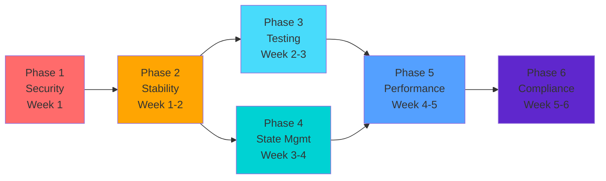
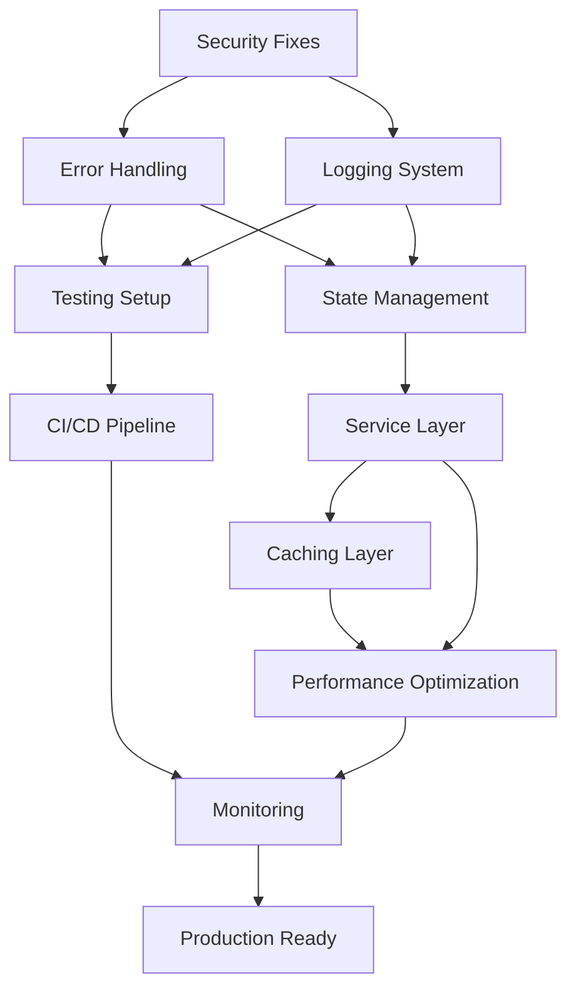

# Infrastructure Improvement Workflow
**Transition from Feature Development to Core Infrastructure**

**Generated:** October 31, 2025
**Strategy:** Systematic Deep Analysis
**Timeline:** 6 weeks to production-ready infrastructure
**Based on:** claudedocs/apps-analysis-report.md

---

## Executive Summary

This workflow systematically addresses the critical infrastructure issues identified in the codebase analysis, transitioning from feature development to establishing a robust, secure, and scalable foundation. The approach prioritizes security vulnerabilities first, then builds layers of stability, testing, and performance optimization.

**Key Metrics:**
- Current State: C- health score, 🔴 High security risk, <5% test coverage
- Target State: B+ health score, 🟢 Low security risk, 80% test coverage
- Timeline: 6 weeks phased implementation
- Resource Requirement: 2 FTE developers + 0.5 FTE DevOps

---

## Phase Structure Overview



---

## 🔴 Phase 1: Critical Security Fixes
**Week 1 | Priority: IMMEDIATE | Blocker: Yes**

### Objectives
Stop security bleeding and eliminate immediate vulnerabilities that could lead to data breaches or service compromise.

### Tasks

#### 1.1 Remove Hardcoded Internal IP (SEV-1)
```typescript
// FROM: backend/src/index.ts:48
console.log(`🚀 Server running on http://10.10.38.110:${PORT}`);

// TO:
const host = process.env.HOST || 'localhost';
console.log(`🚀 Server running on http://${host}:${PORT}`);
```
**Effort:** 1 hour
**Testing:** Verify in all environments
**Dependencies:** None

#### 1.2 Configure CORS Properly (SEV-2)
```typescript
// FROM: backend/src/index.ts:20
app.use("*", cors());

// TO:
import { cors } from 'hono/cors';

const corsOptions = {
  origin: process.env.ALLOWED_ORIGINS?.split(',') || ['http://localhost:8081'],
  credentials: true,
  allowMethods: ['GET', 'POST', 'PUT', 'DELETE'],
  allowHeaders: ['Content-Type', 'Authorization'],
};

app.use('*', cors(corsOptions));
```
**Effort:** 2 hours
**Testing:** Test with frontend origins
**Dependencies:** Environment variables setup

#### 1.3 Fix Type Safety Bypasses (SEV-3)
```typescript
// Create proper WebSocket types
interface AuthenticatedWebSocket extends WebSocket {
  userId?: string;
  sessionId?: string;
  lastActivity?: number;
}

// Replace all (ws as any) with proper typing
```
**Effort:** 4 hours
**Testing:** TypeScript compilation
**Dependencies:** None

#### 1.4 Add Rate Limiting Middleware
```typescript
// backend/src/middleware/rateLimiter.ts
import { Context, Next } from 'hono';
import { RateLimiterMemory } from 'rate-limiter-flexible';

const rateLimiter = new RateLimiterMemory({
  points: 100, // requests
  duration: 60, // per minute
});

export const rateLimitMiddleware = async (c: Context, next: Next) => {
  try {
    await rateLimiter.consume(c.req.header('x-forwarded-for') || 'global');
    await next();
  } catch {
    return c.json({ error: 'Too many requests' }, 429);
  }
};
```
**Effort:** 3 hours
**Testing:** Load testing required
**Dependencies:** rate-limiter-flexible package

#### 1.5 Configure Request Size Limits
```typescript
// backend/src/index.ts
app.use('*', bodyLimit({ maxSize: 1024 * 1024 })); // 1MB limit
```
**Effort:** 1 hour
**Testing:** Test with large payloads
**Dependencies:** None

### Phase 1 Deliverables
- [ ] All SEV-1 and SEV-2 vulnerabilities resolved
- [ ] Security middleware configured
- [ ] Environment variables properly managed
- [ ] Type safety restored
- [ ] Security audit checklist completed

---

## 🟡 Phase 2: Core Stability Foundation
**Week 1-2 | Priority: HIGH | Blocker: Partial**

### Objectives
Establish foundational reliability and observability before adding features.

### Tasks

#### 2.1 Implement Error Boundaries (React Native)
```typescript
// frontend/components/ErrorBoundary.tsx
import React from 'react';

class ErrorBoundary extends React.Component {
  state = { hasError: false, error: null };

  static getDerivedStateFromError(error) {
    return { hasError: true, error };
  }

  componentDidCatch(error, errorInfo) {
    // Log to monitoring service
    logErrorToService(error, errorInfo);
  }

  render() {
    if (this.state.hasError) {
      return <FallbackComponent />;
    }
    return this.props.children;
  }
}
```
**Effort:** 4 hours
**Testing:** Error simulation tests
**Dependencies:** Monitoring service

#### 2.2 Structured Logging System
```typescript
// packages/logger/index.ts
import { createLogger } from 'winston';

export const logger = createLogger({
  level: process.env.LOG_LEVEL || 'info',
  format: winston.format.json(),
  transports: [
    new winston.transports.Console(),
    new winston.transports.File({ filename: 'error.log', level: 'error' }),
  ],
});

// Replace all console.log/error with logger
```
**Effort:** 6 hours
**Testing:** Log output verification
**Dependencies:** winston package

#### 2.3 Environment Configuration Management
```typescript
// packages/config/index.ts
import { z } from 'zod';

const envSchema = z.object({
  NODE_ENV: z.enum(['development', 'production', 'test']),
  PORT: z.string().transform(Number),
  MONGODB_URI: z.string().url(),
  CLERK_SECRET_KEY: z.string(),
  ALLOWED_ORIGINS: z.string(),
  // ... other env vars
});

export const config = envSchema.parse(process.env);
```
**Effort:** 3 hours
**Testing:** Environment validation
**Dependencies:** zod package

#### 2.4 WebSocket Reconnection Logic
```typescript
// frontend/services/websocket.ts
class WebSocketManager {
  private ws: WebSocket | null = null;
  private reconnectAttempts = 0;
  private maxReconnectAttempts = 5;

  connect() {
    this.ws = new WebSocket(WS_URL);

    this.ws.onclose = () => {
      if (this.reconnectAttempts < this.maxReconnectAttempts) {
        setTimeout(() => this.reconnect(), Math.pow(2, this.reconnectAttempts) * 1000);
      }
    };
  }

  private reconnect() {
    this.reconnectAttempts++;
    this.connect();
  }
}
```
**Effort:** 5 hours
**Testing:** Connection failure scenarios
**Dependencies:** None

#### 2.5 MongoDB Connection Pooling
```typescript
// backend/src/services/database.ts
import { MongoClient } from 'mongodb';

const options = {
  maxPoolSize: 10,
  minPoolSize: 2,
  maxIdleTimeMS: 30000,
  serverSelectionTimeoutMS: 5000,
};

let client: MongoClient;

export async function connectDB() {
  if (!client) {
    client = new MongoClient(config.MONGODB_URI, options);
    await client.connect();
  }
  return client.db();
}
```
**Effort:** 2 hours
**Testing:** Connection pool monitoring
**Dependencies:** MongoDB configuration

### Phase 2 Deliverables
- [ ] Error boundaries implemented across app
- [ ] Structured logging replacing console statements
- [ ] Environment configuration validated
- [ ] WebSocket stability improved
- [ ] Database connection optimized

---

## 🔵 Phase 3: Testing Infrastructure
**Week 2-3 | Priority: HIGH | Blocker: No**

### Objectives
Establish comprehensive testing to ensure code quality and prevent regressions.

### Tasks

#### 3.1 Frontend Testing Setup
```json
// frontend/package.json
{
  "scripts": {
    "test": "jest",
    "test:watch": "jest --watch",
    "test:coverage": "jest --coverage"
  },
  "jest": {
    "preset": "jest-expo",
    "transformIgnorePatterns": [
      "node_modules/(?!react-native|expo|@react-native)"
    ],
    "setupFilesAfterEnv": ["<rootDir>/jest.setup.js"]
  }
}
```
**Effort:** 4 hours
**Testing:** Sample test execution
**Dependencies:** jest, @testing-library/react-native

#### 3.2 Backend API Testing
```typescript
// backend/tests/auth.test.ts
import { describe, expect, it } from 'bun:test';
import { app } from '../src/index';

describe('Authentication', () => {
  it('should authenticate valid user', async () => {
    const res = await app.request('/api/auth/login', {
      method: 'POST',
      body: JSON.stringify({ email: 'test@example.com', password: 'password' }),
    });
    expect(res.status).toBe(200);
  });
});
```
**Effort:** 6 hours
**Testing:** Test runner verification
**Dependencies:** Bun test runner

#### 3.3 WebSocket Testing Framework
```typescript
// backend/tests/websocket.test.ts
import { WebSocket } from 'ws';

describe('WebSocket Sessions', () => {
  let ws: WebSocket;

  beforeEach(() => {
    ws = new WebSocket('ws://localhost:3000');
  });

  afterEach(() => {
    ws.close();
  });

  it('should handle session creation', (done) => {
    ws.on('message', (data) => {
      const message = JSON.parse(data);
      expect(message.type).toBe('session_created');
      done();
    });

    ws.on('open', () => {
      ws.send(JSON.stringify({ type: 'create_session' }));
    });
  });
});
```
**Effort:** 5 hours
**Testing:** WebSocket scenarios
**Dependencies:** ws package for testing

#### 3.4 CI/CD Pipeline Configuration
```yaml
# .github/workflows/ci.yml
name: CI

on: [push, pull_request]

jobs:
  test:
    runs-on: ubuntu-latest
    steps:
      - uses: actions/checkout@v2
      - uses: oven-sh/setup-bun@v1
      - run: bun install
      - run: bun test
      - run: bun run lint
      - run: bun run typecheck

  coverage:
    runs-on: ubuntu-latest
    steps:
      - uses: actions/checkout@v2
      - run: bun test --coverage
      - uses: codecov/codecov-action@v3
```
**Effort:** 3 hours
**Testing:** Pipeline execution
**Dependencies:** GitHub Actions

#### 3.5 Critical Path Tests
- Authentication flow (login, logout, session)
- Session creation and joining
- Swipe mechanics and matching
- WebSocket connection and reconnection
- Data persistence and retrieval

**Effort:** 8 hours
**Testing:** End-to-end scenarios
**Dependencies:** All test infrastructure

### Phase 3 Deliverables
- [ ] Jest configured for React Native
- [ ] Bun test for backend APIs
- [ ] WebSocket testing framework
- [ ] CI/CD pipeline running tests
- [ ] 80% coverage on critical paths

---

## 🟢 Phase 4: State & Data Management
**Week 3-4 | Priority: MEDIUM | Blocker: No**

### Objectives
Implement scalable state management and data architecture patterns.

### Tasks

#### 4.1 Frontend State Management (Zustand)
```typescript
// frontend/store/sessionStore.ts
import { create } from 'zustand';
import { devtools, persist } from 'zustand/middleware';

interface SessionState {
  sessionId: string | null;
  participants: User[];
  currentRound: number;
  matches: Match[];

  createSession: () => Promise<void>;
  joinSession: (code: string) => Promise<void>;
  submitSwipe: (itemId: string, direction: 'left' | 'right') => void;
}

export const useSessionStore = create<SessionState>()(
  devtools(
    persist(
      (set, get) => ({
        sessionId: null,
        participants: [],
        currentRound: 0,
        matches: [],

        createSession: async () => {
          // Implementation
        },
        // ... other methods
      }),
      { name: 'session-storage' }
    )
  )
);
```
**Effort:** 8 hours
**Testing:** State persistence tests
**Dependencies:** zustand package

#### 4.2 Backend Service Layer
```typescript
// backend/src/services/sessionService.ts
export class SessionService {
  constructor(
    private db: Database,
    private cache: CacheService,
    private ws: WebSocketService
  ) {}

  async createSession(userId: string): Promise<Session> {
    // Business logic separated from routes
    const session = await this.db.sessions.create({
      hostId: userId,
      code: generateCode(),
      createdAt: new Date(),
    });

    await this.cache.set(`session:${session.id}`, session);
    this.ws.notifySessionCreated(session);

    return session;
  }
}
```
**Effort:** 10 hours
**Testing:** Service layer tests
**Dependencies:** Dependency injection setup

#### 4.3 Redis Caching Layer
```typescript
// backend/src/services/cache.ts
import { Redis } from 'ioredis';

export class CacheService {
  private redis: Redis;

  constructor() {
    this.redis = new Redis({
      host: config.REDIS_HOST,
      port: config.REDIS_PORT,
      retryStrategy: (times) => Math.min(times * 50, 2000),
    });
  }

  async get<T>(key: string): Promise<T | null> {
    const value = await this.redis.get(key);
    return value ? JSON.parse(value) : null;
  }

  async set(key: string, value: any, ttl = 3600): Promise<void> {
    await this.redis.set(key, JSON.stringify(value), 'EX', ttl);
  }
}
```
**Effort:** 4 hours
**Testing:** Cache operations
**Dependencies:** Redis setup, ioredis

#### 4.4 Pagination Implementation
```typescript
// backend/src/middleware/pagination.ts
export const paginate = (defaultLimit = 20) => {
  return async (c: Context, next: Next) => {
    const page = parseInt(c.req.query('page') || '1');
    const limit = parseInt(c.req.query('limit') || String(defaultLimit));

    c.set('pagination', {
      page: Math.max(1, page),
      limit: Math.min(100, Math.max(1, limit)),
      skip: (Math.max(1, page) - 1) * Math.min(100, Math.max(1, limit)),
    });

    await next();
  };
};
```
**Effort:** 3 hours
**Testing:** Pagination scenarios
**Dependencies:** None

#### 4.5 Dependency Injection Setup
```typescript
// backend/src/container.ts
import { Container } from 'inversify';

const container = new Container();

container.bind<Database>('Database').toConstantValue(database);
container.bind<CacheService>('Cache').to(CacheService).inSingletonScope();
container.bind<SessionService>('SessionService').to(SessionService);
container.bind<WebSocketService>('WebSocket').to(WebSocketService).inSingletonScope();

export { container };
```
**Effort:** 5 hours
**Testing:** DI container tests
**Dependencies:** inversify

### Phase 4 Deliverables
- [ ] Zustand state management implemented
- [ ] Service layer abstraction complete
- [ ] Redis caching operational
- [ ] Pagination on all list endpoints
- [ ] Dependency injection configured

---

## ⚡ Phase 5: Performance Optimization
**Week 4-5 | Priority: MEDIUM | Blocker: No**

### Objectives
Optimize application performance for production scale.

### Tasks

#### 5.1 React Component Optimization
```typescript
// frontend/components/SwipeCard.tsx
import React, { memo, useMemo, useCallback } from 'react';

export const SwipeCard = memo(({ item, onSwipe }) => {
  const handleSwipe = useCallback((direction) => {
    onSwipe(item.id, direction);
  }, [item.id, onSwipe]);

  const imageStyle = useMemo(() => ({
    width: '100%',
    height: 300,
    resizeMode: 'cover',
  }), []);

  return (
    // Component JSX
  );
}, (prevProps, nextProps) => {
  return prevProps.item.id === nextProps.item.id;
});
```
**Effort:** 6 hours
**Testing:** Render performance
**Dependencies:** React DevTools

#### 5.2 Image Optimization
```typescript
// frontend/components/OptimizedImage.tsx
import { Image } from 'expo-image';

export const OptimizedImage = ({ source, ...props }) => {
  const optimizedSource = useMemo(() => {
    if (typeof source === 'string') {
      return {
        uri: source,
        cache: 'force-cache',
        priority: props.priority || 'normal',
      };
    }
    return source;
  }, [source]);

  return (
    <Image
      source={optimizedSource}
      placeholder={blurhash}
      contentFit="cover"
      transition={200}
      {...props}
    />
  );
};
```
**Effort:** 4 hours
**Testing:** Image loading metrics
**Dependencies:** expo-image

#### 5.3 List Virtualization
```typescript
// frontend/screens/BrowseScreen.tsx
import { FlashList } from '@shopify/flash-list';

export const BrowseScreen = () => {
  return (
    <FlashList
      data={items}
      renderItem={renderItem}
      estimatedItemSize={200}
      keyExtractor={(item) => item.id}
      onEndReachedThreshold={0.5}
      onEndReached={loadMore}
      ListEmptyComponent={EmptyState}
    />
  );
};
```
**Effort:** 3 hours
**Testing:** Scroll performance
**Dependencies:** @shopify/flash-list

#### 5.4 Request Compression
```typescript
// backend/src/middleware/compression.ts
import { compress } from 'hono/compress';

app.use('*', compress({
  encoding: 'gzip',
  threshold: 1024, // Compress responses larger than 1KB
}));
```
**Effort:** 1 hour
**Testing:** Response size metrics
**Dependencies:** Built-in Hono middleware

#### 5.5 WebSocket Batching
```typescript
// backend/src/websocket/batcher.ts
class MessageBatcher {
  private queue: Message[] = [];
  private timer: NodeJS.Timeout | null = null;

  add(message: Message) {
    this.queue.push(message);

    if (!this.timer) {
      this.timer = setTimeout(() => this.flush(), 50);
    }
  }

  private flush() {
    if (this.queue.length > 0) {
      this.broadcast({
        type: 'batch',
        messages: this.queue,
      });
      this.queue = [];
    }
    this.timer = null;
  }
}
```
**Effort:** 3 hours
**Testing:** Message throughput
**Dependencies:** None

#### 5.6 Performance Monitoring Setup
```typescript
// frontend/services/monitoring.ts
import * as Sentry from '@sentry/react-native';

Sentry.init({
  dsn: config.SENTRY_DSN,
  tracesSampleRate: 0.2,
  integrations: [
    new Sentry.ReactNativeTracing({
      tracingOrigins: ['localhost', /^\/api/],
      routingInstrumentation: Sentry.reactNavigationInstrumentation(navigation),
    }),
  ],
});

// Track Core Web Vitals
export const trackPerformance = (metric: string, value: number) => {
  Sentry.addBreadcrumb({
    category: 'performance',
    message: metric,
    level: 'info',
    data: { value },
  });
};
```
**Effort:** 4 hours
**Testing:** Metrics collection
**Dependencies:** @sentry/react-native

### Phase 5 Deliverables
- [ ] React components optimized with memo/useMemo
- [ ] Image loading optimized
- [ ] Lists virtualized
- [ ] Compression enabled
- [ ] WebSocket messages batched
- [ ] Performance monitoring active

---

## 🟣 Phase 6: Compliance & Monitoring
**Week 5-6 | Priority: MEDIUM | Blocker: No**

### Objectives
Ensure legal compliance and production observability.

### Tasks

#### 6.1 GDPR Compliance Implementation
```typescript
// backend/src/services/gdpr.ts
export class GDPRService {
  async exportUserData(userId: string): Promise<UserDataExport> {
    const [profile, preferences, sessions, swipes] = await Promise.all([
      this.db.users.findOne({ id: userId }),
      this.db.preferences.find({ userId }),
      this.db.sessions.find({ participants: userId }),
      this.db.swipes.find({ userId }),
    ]);

    return {
      profile: this.sanitizeProfile(profile),
      preferences,
      sessionHistory: sessions.map(s => this.sanitizeSession(s)),
      swipeHistory: swipes,
      exportedAt: new Date(),
    };
  }

  async deleteUserData(userId: string): Promise<void> {
    await Promise.all([
      this.db.users.deleteOne({ id: userId }),
      this.db.preferences.deleteMany({ userId }),
      this.db.swipes.deleteMany({ userId }),
      this.anonymizeSessionData(userId),
    ]);
  }
}
```
**Effort:** 8 hours
**Testing:** Data export/deletion
**Dependencies:** Legal review

#### 6.2 Data Retention Policies
```typescript
// backend/src/jobs/dataRetention.ts
import { CronJob } from 'cron';

const retentionJob = new CronJob('0 0 * * *', async () => {
  const cutoffDate = new Date();
  cutoffDate.setDays(cutoffDate.getDate() - 90);

  // Delete old sessions
  await db.sessions.deleteMany({
    createdAt: { $lt: cutoffDate },
    status: 'completed',
  });

  // Anonymize old swipe data
  await db.swipes.updateMany(
    { createdAt: { $lt: cutoffDate } },
    { $unset: { userId: 1 } }
  );

  logger.info('Data retention job completed');
});

retentionJob.start();
```
**Effort:** 4 hours
**Testing:** Job execution
**Dependencies:** cron package

#### 6.3 Monitoring & Alerting Setup
```typescript
// backend/src/monitoring/alerts.ts
import { PrometheusExporter } from '@opentelemetry/exporter-prometheus';

const meter = new PrometheusExporter({
  port: 9090,
  startServer: true,
}, () => {
  console.log('Prometheus metrics server started on port 9090');
});

// Track key metrics
export const metrics = {
  activeUsers: meter.createGauge('active_users', {
    description: 'Number of active users',
  }),

  sessionCreationRate: meter.createCounter('session_creation_rate', {
    description: 'Rate of session creation',
  }),

  swipeLatency: meter.createHistogram('swipe_latency', {
    description: 'Swipe processing latency',
    boundaries: [0, 50, 100, 200, 500, 1000],
  }),
};
```
**Effort:** 5 hours
**Testing:** Metrics verification
**Dependencies:** OpenTelemetry

#### 6.4 API Versioning Strategy
```typescript
// backend/src/routes/v1/index.ts
const v1 = new Hono();

v1.route('/auth', authRoutes);
v1.route('/sessions', sessionRoutes);
v1.route('/users', userRoutes);

app.route('/api/v1', v1);

// Version header support
app.use('*', async (c, next) => {
  const version = c.req.header('API-Version') || 'v1';
  c.set('apiVersion', version);
  await next();
});
```
**Effort:** 3 hours
**Testing:** Version routing
**Dependencies:** None

#### 6.5 Security Headers & Audit Logging
```typescript
// backend/src/middleware/security.ts
import helmet from 'helmet';

app.use('*', helmet({
  contentSecurityPolicy: {
    directives: {
      defaultSrc: ["'self'"],
      styleSrc: ["'self'", "'unsafe-inline'"],
      scriptSrc: ["'self'"],
      imgSrc: ["'self'", "data:", "https:"],
    },
  },
  hsts: {
    maxAge: 31536000,
    includeSubDomains: true,
    preload: true,
  },
}));

// Audit logging
app.use('*', async (c, next) => {
  const start = Date.now();
  await next();

  await auditLog.write({
    method: c.req.method,
    path: c.req.path,
    userId: c.get('userId'),
    status: c.res.status,
    duration: Date.now() - start,
    timestamp: new Date(),
  });
});
```
**Effort:** 3 hours
**Testing:** Header verification
**Dependencies:** helmet equivalent for Hono

#### 6.6 Backup & Disaster Recovery
```typescript
// scripts/backup.sh
#!/bin/bash

# MongoDB backup
mongodump --uri="$MONGODB_URI" --out="/backups/$(date +%Y%m%d_%H%M%S)"

# Upload to S3
aws s3 sync /backups s3://dindin-backups/ --delete

# Cleanup old local backups
find /backups -type d -mtime +7 -exec rm -rf {} \;
```
**Effort:** 4 hours
**Testing:** Backup restoration
**Dependencies:** AWS S3 setup

### Phase 6 Deliverables
- [ ] GDPR compliance implemented
- [ ] Data retention policies active
- [ ] Monitoring and metrics operational
- [ ] API versioning in place
- [ ] Security headers configured
- [ ] Backup procedures tested

---

## Dependency Map & Execution Strategy

### Critical Path Dependencies


### Parallel Execution Opportunities

#### Week 1
- **Track 1:** Security fixes (Phase 1)
- **Track 2:** Documentation preparation for GDPR

#### Week 2
- **Track 1:** Complete stability foundation
- **Track 2:** Testing framework setup
- **Track 3:** Research state management patterns

#### Week 3-4
- **Track 1:** State management implementation
- **Track 2:** Complete testing infrastructure
- **Track 3:** Begin performance profiling

#### Week 5-6
- **Track 1:** Performance optimization
- **Track 2:** Compliance implementation
- **Track 3:** Monitoring setup

### Resource Allocation

| Week | Backend Dev | Frontend Dev | DevOps | QA |
|------|------------|--------------|--------|-----|
| 1 | Security fixes | Error boundaries | - | Test planning |
| 2 | Stability, WebSocket | Logging integration | CI/CD setup | Framework setup |
| 3 | Service layer | State management | Redis setup | Write tests |
| 4 | Caching, pagination | Component optimization | - | Integration tests |
| 5 | API optimization | Performance tuning | Monitoring | Load testing |
| 6 | Compliance | Final optimization | Deployment | Acceptance testing |

---

## Success Metrics & Exit Criteria

### Phase Completion Criteria

#### Phase 1 ✅
- [ ] Zero high/critical security vulnerabilities
- [ ] All hardcoded values removed
- [ ] Rate limiting active on all endpoints
- [ ] Security audit passed

#### Phase 2 ✅
- [ ] Error rate < 0.1%
- [ ] All errors logged to centralized system
- [ ] WebSocket reconnection success rate > 99%
- [ ] Database connection pool stable

#### Phase 3 ✅
- [ ] 80% code coverage on critical paths
- [ ] CI/CD pipeline running all tests
- [ ] Test execution time < 5 minutes
- [ ] All tests passing

#### Phase 4 ✅
- [ ] State management handling all session data
- [ ] Cache hit rate > 80%
- [ ] All endpoints paginated
- [ ] Service layer fully abstracted

#### Phase 5 ✅
- [ ] Swipe latency < 100ms (p95)
- [ ] Initial load time < 3 seconds
- [ ] Memory usage stable under load
- [ ] WebSocket message batching effective

#### Phase 6 ✅
- [ ] GDPR compliance certified
- [ ] 99.9% uptime achieved
- [ ] All metrics being tracked
- [ ] Disaster recovery tested

### Overall Success Metrics
- **Security Score:** From 🔴 High Risk to 🟢 Low Risk
- **Test Coverage:** From <5% to >80%
- **Performance:** Meet all PRD latency requirements
- **Stability:** <0.1% error rate, 99.9% uptime
- **Compliance:** GDPR ready, data retention automated
- **Monitoring:** Full observability stack operational

---

## Risk Mitigation

### Technical Risks
| Risk | Mitigation |
|------|------------|
| WebSocket scaling issues | Implement socket.io with Redis adapter early |
| Performance degradation | Continuous monitoring, gradual rollout |
| Data migration failures | Comprehensive backup strategy, rollback plans |
| Security breach during transition | Incremental security improvements, continuous scanning |

### Process Risks
| Risk | Mitigation |
|------|------------|
| Scope creep | Strict phase gates, no feature work until Phase 6 |
| Resource availability | Cross-training, documentation |
| Integration failures | Feature flags, gradual rollout |
| User disruption | Maintain backwards compatibility, versioned APIs |

---

## Communication Plan

### Weekly Updates
- **Monday:** Phase kickoff, goals for week
- **Wednesday:** Progress check, blocker review
- **Friday:** Phase completion status, next week prep

### Stakeholder Communication
- **Executive Summary:** Weekly progress percentage
- **Technical Team:** Daily standups during critical phases
- **QA Team:** Test readiness reviews before each phase
- **Users:** Planned maintenance windows communicated 48h in advance

---

## Rollback Procedures

Each phase includes rollback capability:

1. **Git branches:** Separate branch per phase
2. **Feature flags:** Toggle new functionality
3. **Database migrations:** Reversible migrations only
4. **API versions:** Maintain v1 throughout transition
5. **Monitoring:** Automated rollback triggers on error spikes

---

## Post-Implementation Review

After Phase 6 completion:

1. **Technical Debt Assessment:** Identify remaining issues
2. **Performance Baseline:** Establish production metrics
3. **Security Audit:** Third-party penetration testing
4. **Team Retrospective:** Lessons learned documentation
5. **Documentation Update:** Architecture diagrams, runbooks
6. **Knowledge Transfer:** Team training on new systems

---

## Appendix: Quick Reference

### Priority Order (Must Do First)
1. Remove hardcoded IP (1 hour)
2. Fix CORS (2 hours)
3. Add rate limiting (3 hours)
4. Fix type safety (4 hours)
5. Add error boundaries (4 hours)

### Packages to Install
```bash
# Backend
bun add rate-limiter-flexible winston zod ioredis inversify cron @opentelemetry/exporter-prometheus

# Frontend
bun add zustand @shopify/flash-list @sentry/react-native
```

### Environment Variables to Add
```env
# Security
ALLOWED_ORIGINS=http://localhost:8081,http://localhost:3000
API_RATE_LIMIT=100

# Infrastructure
REDIS_HOST=localhost
REDIS_PORT=6379
SENTRY_DSN=your-sentry-dsn
LOG_LEVEL=info

# Compliance
DATA_RETENTION_DAYS=90
ENABLE_AUDIT_LOG=true
```

### Testing Commands
```bash
# Run all tests
bun test

# Run with coverage
bun test --coverage

# Run specific phase tests
bun test --grep "Security"
bun test --grep "Performance"
```

---

*This workflow document provides a systematic, phased approach to transitioning from feature development to establishing robust infrastructure. Follow phases sequentially, with parallel tracks where indicated. Success depends on completing each phase's exit criteria before proceeding.*